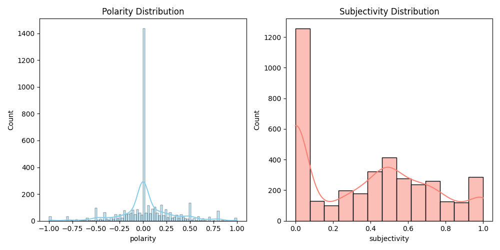
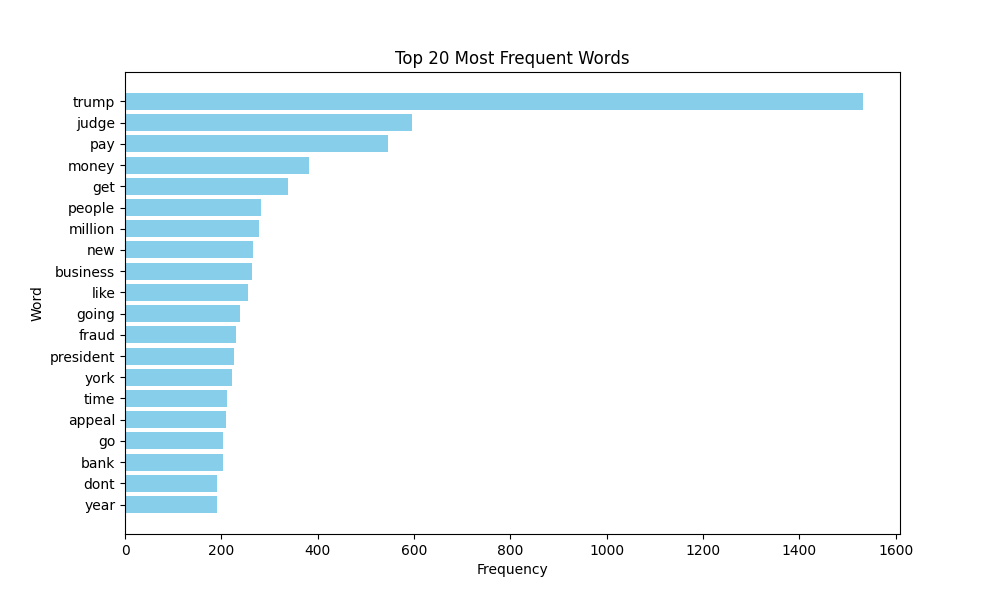
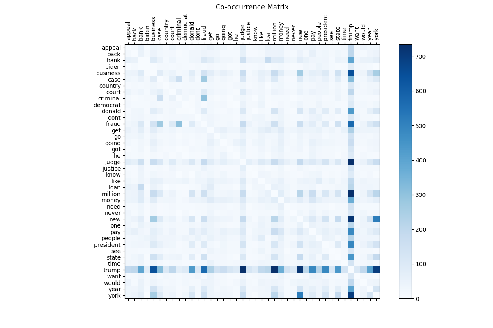
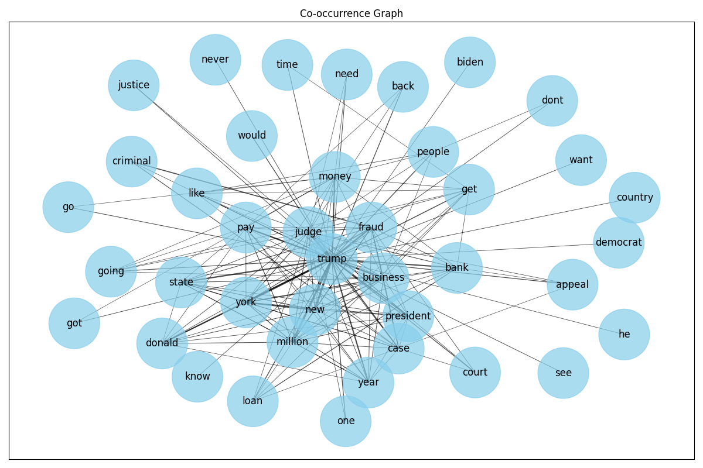
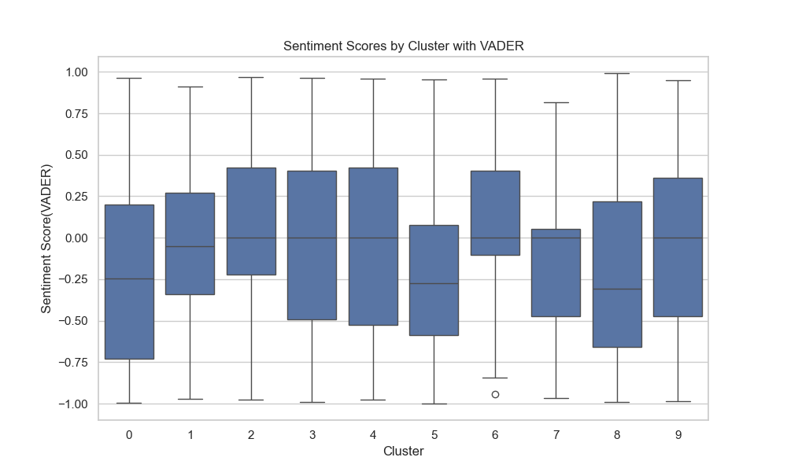
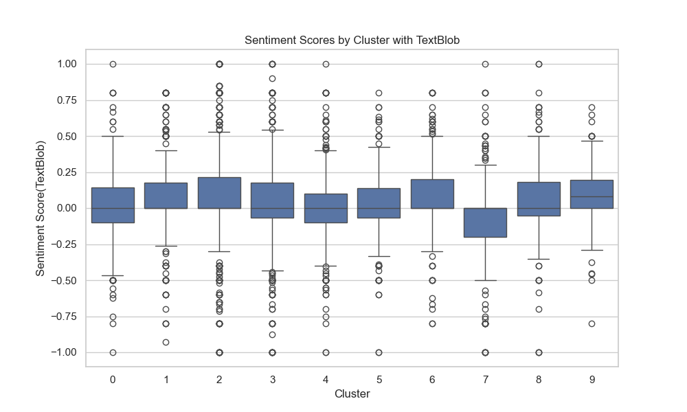
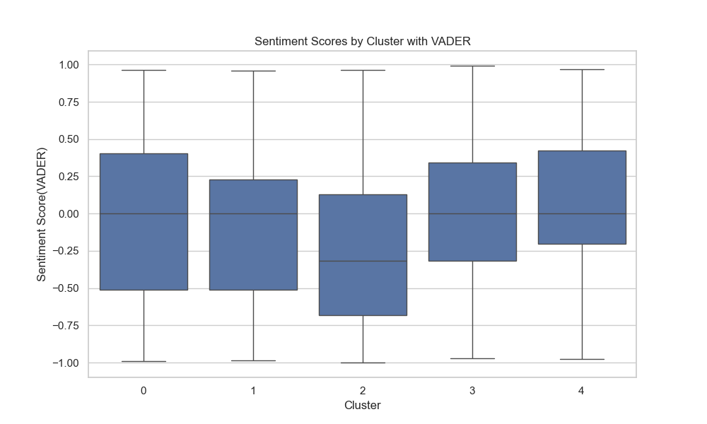
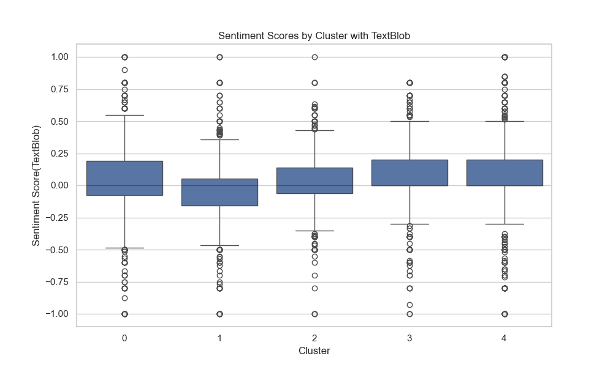

# Project Report

## Category

[toc]

## Overview

## Data Collection

First, sign up for a Google Developer Account, then activate the YouTube API key.

With the API key and the video URL https://www.youtube.com/watch?v=DT5jDcXVm6E, it's easy to scrape all the data into `YouTube_DT5jDcXVm6E.json`.

##  Data Preprocessing

1. Get rid of the non-English words and all the punctuation marks.
2. Convert to lowercase and store them in `cleaned_comments.json`.
3. Tokenize the comments, take out the stop words, and save it to `tokenized_comments.json`.
4. Make a word cloud (just for fun).


## Semantic Analysis

`textblob` is used for semantic analysis.

The result is not that interesting.



Plus, it's not accurate at all. Here are 10 random neutral comments:

```csv
                                                comment  polarity  subjectivity
3081  banana republic politic witch hunt you dont ev...       0.0        0.0000
2894                                  slap on the wrist       0.0        0.0000
375   call it a blessing and head to texas president...       0.0        0.0000
3066  hhahahaha 355 millions dollars to be paid by e...       0.0        0.1000
2715                                         not enough       0.0        0.5000
3881  same way trump said about nato members you hav...       0.0        0.0625
1027                              cry maga traitors cry       0.0        0.0000
1686           responsibility matters for all lives usa       0.0        0.0000
3126                             yay yay and thrice yay       0.0        0.0000
324   so tell me again why is he asking for immunity...       0.0        0.0000
```

Clearly, human reviewers will regard them as highly subjective and polarizing.

Therefore, it's probably not a good choice to do a political sentiment analysis with `textblob`.

Now the question is: how to practically aggregate the comments?

## Word Frequency Analysis



## Co-occurrence Matrix



## Co-occurrence Graph



## Data Collection Pipeline

10min for every video.

Difficulties with collection more comments. 

## Comments Clustering

### 10 Clusters

```
gmm = GMM(n_components=10, covariance_type='diag', max_iter=2000, random_state=0).fit(embeddings_df)
```

Done the comments clustering. And for each cluster, I did sentiment analysis.





It not hard to interpret that most of sentiment score from textblob is just 0.

The sentiment score is hardly correlated with the cluster, suggesting that there is no significant difference in sentiment across different clusters. In other words, the sentiment expressed in the comments does not vary significantly depending on the cluster they belong to.

### 5 Clusters





## Fine-tuning Large Language Model

## Stance detection based on Knowledge Graph